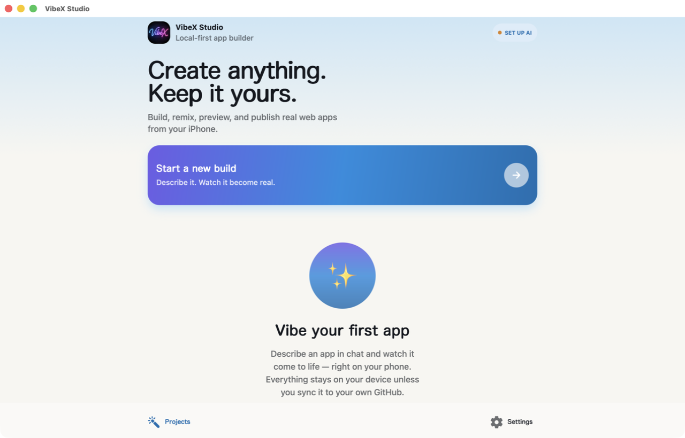
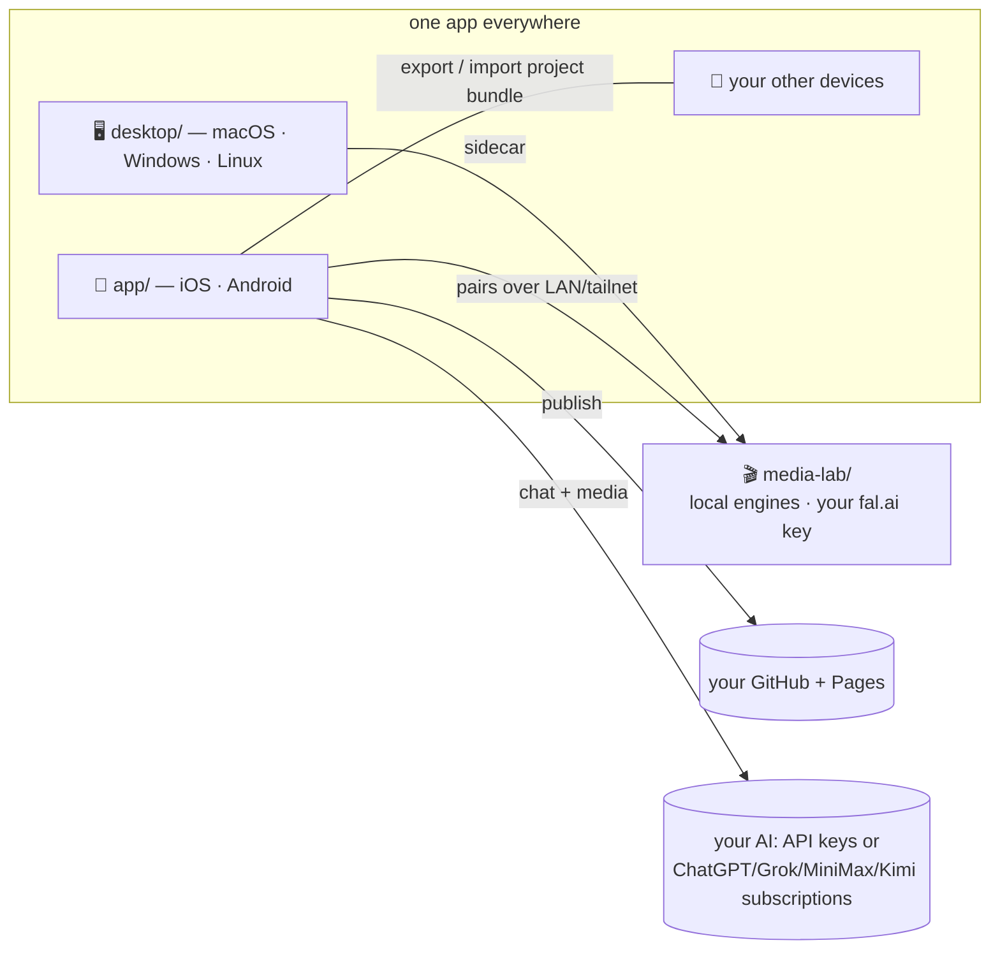

# VibeXStudio 🪄 — now featuring Media Lab

**One open-source studio for building apps and making media, on every device
you own — with nothing to sign up for.**

Describe an app in chat, reuse saved Media Lab creations, and preview the result.
Projects are saved locally; prompts and selected files go to the services you
connect. Share a project bundle or publish through your GitHub account.
Provider generation runs on the provider's servers, while qualified local
engines run on the Media Lab host you select.

**Development status:** the unified Library, independent CPU background removal,
and experimental 3D workflows are under active development. Not every advertised
platform or engine has completed runtime qualification. See
[capability status](docs/CAPABILITY-STATUS.md) before choosing a deployment.

<p align="center">
  
  &nbsp;
  
</p>
<p align="center">
  
  &nbsp;
  
</p>

## Get it

| Platform | How |
|---|---|
| **macOS** (Apple Silicon) | [Notarized .dmg](https://github.com/kerpopule/vibexstudio/releases/latest) |
| **Windows** x64 | [Installer](https://github.com/kerpopule/vibexstudio/releases/latest) *(unsigned for now — SmartScreen asks once)* |
| **Linux** x64 / arm64 | [.deb / .AppImage](https://github.com/kerpopule/vibexstudio/releases/latest) |
| **iPhone / iPad · Android** | App Store & Google Play releases in progress — or build from source below |

## One repo, three parts

| Directory | What it is |
|---|---|
| [`app/`](app/) | The VibeXStudio app — Expo/React Native for iOS, Android, and the web build the desktop wraps. Chat-to-app builder, background builds, local projects, and Media Lab integration. |
| [`desktop/`](desktop/) | Tauri shell for macOS/Windows/Linux. Hosts the app and can run Media Lab as a local sidecar. |
| [`media-lab/`](media-lab/) | The Media Lab server — films, songs, images, characters, and Sparky the director. Run it on your own GPU box, or cloud-only with your fal.ai key. |



## The one-stop-shop idea

- **A one-minute setup, not a settings hunt.** First launch asks four
  questions — *which AI do you already have · where should media get
  made · is there a computer nearby · want to publish?* — every one
  skippable, every one revisitable from the **Setup** tab's checklist.
- **Build**: chat → files → live preview → publish to your GitHub Pages.
- **Make media, three ways** — the Media Lab tab uses whichever you have:
  1. **Connected providers**: request images and video through your
     connected providers (ChatGPT/OpenAI images, Grok/xAI, Gemini/Veo)
     into a local gallery — no server needed.
  2. **Your fal.ai key**: cloud rendering through Media Lab's provider
     settings.
  3. **Your own hardware**: pair a Media Lab server — the desktop app
     hosts one, or a DGX Spark / any GPU box runs the full studio: LTX
     drafts, cinematic H3, music, characters, Sparky the director.
- **✂️ Cut** — Media Lab's built-in editor. Open any video or picture from
  the gallery (or send one over from the app), trim, split, reorder, add
  dissolves, captions, audio mix and color, and render on the CPU — on a
  phone, a tablet, or a desktop browser. The same commands drive it from
  an agent or the `tools/cut` CLI ([media-lab/docs/CUT.md](media-lab/docs/CUT.md)).
- **Bring the AI you already pay for**: subscription sign-in for
  **ChatGPT (Plus/Pro)**, xAI/Grok, MiniMax, and Kimi — the vendors' own
  app ids, no API key — or keys for OpenRouter, Anthropic, OpenAI, Gemini,
  GLM, and any OpenAI-style endpoint (Ollama, LM Studio, vLLM).
- **Pair in one scan**: the desktop app and the Spark installer both show
  a QR; the app's camera reads it and pairs Media Lab and the Workbench
  (your computer installing, building, and serving real projects for
  your phone) at once. Or type an address — no IPs unless you want them.
- **Agents welcome**: Hermes, Claude Code, Codex, OpenCode or any MCP
  client can drive the app over your Wi-Fi with your approval; Media Lab
  and Cut expose the same commands the UI uses.
- **Share your projects**: export/import a `.vibex` bundle or use GitHub.
  Automatic cross-device iCloud/Drive sync is not established in the current
  local project store. See [storage and sync](app/docs/SYNC.md).

## Media Lab on your own box, one command

```sh
git clone https://github.com/kerpopule/vibexstudio && cd vibexstudio/media-lab
./install.sh          # venv, service, access code, then a QR in your terminal
```

Pairing connects the client to the server; it does not install or qualify every
engine. Review supported hardware, downloads, terms, and capability status before
installing a model. The independent background-removal setup is a development
workflow; the 3D pack is still experimental and not generally installable.
Legacy video/music paths remain separate. See
[installation instructions](media-lab/docs/INSTALL.md) and
[capability status](docs/CAPABILITY-STATUS.md).

## Build from source

```sh
cd app && npm install
npm run ios | android | web            # the app
cd ../desktop && npm install && npx tauri build   # the desktop shell
cd ../media-lab && ./install.sh         # the studio server (or: uvicorn app:app --port 7863)
```

Contributor guides live inside each part: [`app/CLAUDE.md`](app/CLAUDE.md)
(architecture invariants), [`app/docs/SYNC.md`](app/docs/SYNC.md),
[`media-lab/AGENTS.md`](media-lab/AGENTS.md) (agent-guided setup), and
[`media-lab/docs/`](media-lab/docs/).

## Privacy, in one paragraph

The app stores projects locally. Connected AI providers receive prompts and
selected files; GitHub receives content you choose to publish. A paired Media Lab
server stores its jobs and creations on that host. Imported assets are copied
into the project so exports do not depend on that server remaining online.
Model weights and private deployment credentials are not included in the public
controller; installed runtimes and providers have their own terms.

## License & credits

VibeXStudio’s own code is offered under Apache-2.0. Third-party code, runtimes,
and model weights retain their own licenses. Legacy Media Lab integrations still
include Maestro/WanGP paths; their removal is not complete. We credit everything we build on, required or
not — [`app/CREDITS.md`](app/CREDITS.md) ·
[`desktop/CREDITS.md`](desktop/CREDITS.md) ·
[`media-lab/CREDITS.md`](media-lab/CREDITS.md). If your work appears
uncredited, open an issue.
