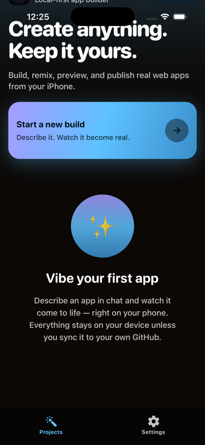

# VibeXStudio 🪄

**Vibe-code real apps on any device you own — and keep everything yours.**

Describe the app you want in chat. VibeX writes the files, renders a live
preview, and keeps the whole project on your device. Publish to **your own
GitHub** and share with a link. Pair a **Media Lab** and make images, video,
and music too. Free, open source, Apache-2.0.

**Local-first. No mandatory account. No analytics or telemetry.** You bring
your own AI key (or an AI subscription you already pay for), so direct
connections send prompts from your device to the provider you choose. An
optional Private VibeX invite routes through its disclosed private broker only
after you review and accept the in-app notice.

<p align="center">
  
  &nbsp;
  
  &nbsp;
  
</p>

## Get it

| Platform | How |
|---|---|
| **macOS** (Apple Silicon) | [Download the notarized .dmg](https://github.com/kerpopule/vibexstudio/releases/latest) |
| **Windows** x64 | [Download the installer](https://github.com/kerpopule/vibexstudio/releases/latest) *(unsigned for now — SmartScreen will ask once)* |
| **Linux** x64 / arm64 | [.deb or .AppImage](https://github.com/kerpopule/vibexstudio/releases/latest) |
| **iPhone / iPad** | App Store release in progress — or build from source below |
| **Android** | Play release in progress — or `npm run android` |

## What makes it different

- **A one-minute setup.** First launch asks what you already have — a
  ChatGPT, Grok, MiniMax or Kimi plan (sign in, no key), or a key for
  OpenRouter, Anthropic, OpenAI, Gemini, GLM, or any OpenAI-style endpoint —
  then where media should get made, and whether there's a computer to pair.
  Every step is skippable; the **Setup** tab keeps the same checklist.
- **An idea is enough.** Chat → files → live preview, in seconds, with the
  AI you connected.
- **Builds keep going when you leave.** Turns stream in the background with
  hardware-scaled concurrency (several projects at once), local
  notifications when a build finishes or needs you, and automatic resume.
- **Local projects, portable files.** Apple projects stay on the device in
  this first release; ordinary Files, AirDrop, and `.vibex` import/export keep
  them portable. Android can also mirror to a folder you choose.
  ([How storage works](docs/SYNC.md))
- **Publishing is yours too.** One tap pushes the project to your GitHub
  and serves it on GitHub Pages with a shareable link.
- **Media Lab inside.** The Media Lab tab works out of the box: an
  **on-device studio** generates images (Gemini / GPT Image / Grok Imagine —
  API key or your Grok subscription) and video (Veo) straight into a
  persistent gallery, no server needed. Pair a full
  [Media Lab](https://github.com/kerpopule/media-lab-studio) (the desktop app
  can host one, or your own GPU box — scan its QR and you're paired) and the
  tab also hosts its complete web UI — image, video, music, characters, and
  **✂️ Cut**, the built-in editor: trim, split, dissolve, caption, mix, and
  render any video or picture, including ones made on this device.

## The VibeXStudio family


| Repo | What it is |
|---|---|
| **[vibexstudio](https://github.com/kerpopule/vibexstudio)** (this one) | The app — Expo/React Native for iOS, Android, and the web build the desktop app wraps |
| **[vibexstudio-desktop](https://github.com/kerpopule/vibexstudio-desktop)** | Tauri shell for Mac/Windows/Linux + the Media Lab sidecar |
| **[media-lab-studio](https://github.com/kerpopule/media-lab-studio)** | The media studio server — run it on your own hardware, or cloud-only with your fal.ai key |

## Build from source

```sh
npm install
npm run ios        # iOS simulator (macOS + Xcode)
npm run android    # Android
npm run web        # browser
npm test && npm run typecheck && npm run lint
```

Everything else a contributor needs — architecture invariants, the chat
engine contract, theming rules — lives in [CLAUDE.md](CLAUDE.md) (written
for AI pair-programmers, great for humans too), [docs/SYNC.md](docs/SYNC.md),
and [CREDITS.md](CREDITS.md).

## Privacy, in one paragraph

Projects, chats, and media live on your device; ordinary file sharing lets you
move exported `.vibex` copies where you choose. API keys live in the OS keychain. The app talks to the
AI provider you configure, your GitHub, and any Media Lab you pair. If you
accept a Private VibeX invite, its prompts and output also pass through the
private broker described before connection. See [PRIVACY.md](PRIVACY.md).

## License

Apache-2.0 · We credit everything we build on, required or not — see
[CREDITS.md](CREDITS.md). If your work appears uncredited, open an issue.
