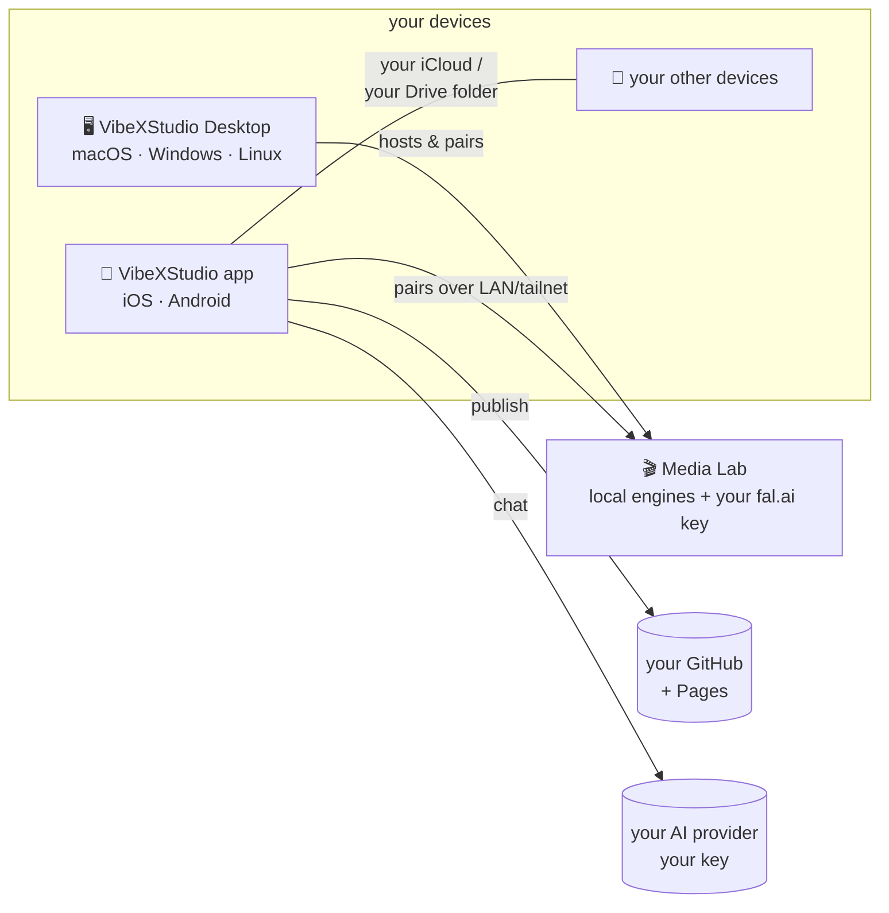

# VibeXStudio 🪄

**Vibe-code real apps on any device you own — and keep everything yours.**

Describe the app you want in chat. VibeX writes the files, renders a live
preview, and keeps the whole project on your device. Publish to **your own
GitHub** and share with a link. Pair a **Media Lab** and make images, video,
and music too. Free, open source, Apache-2.0.

**No servers. No accounts. No telemetry. Ever.** You bring your own AI key
(or an AI subscription you already pay for) — your prompts go straight from
your device to your chosen provider and nowhere else.

<p align="center">
  
  &nbsp;
  
  &nbsp;
  
</p>

## Get it

| Platform | How |
|---|---|
| **macOS** (Apple Silicon) | [Download the notarized .dmg](https://github.com/kerpopule/vibexstudio-desktop/releases/latest) |
| **Windows** x64 | [Download the installer](https://github.com/kerpopule/vibexstudio-desktop/releases/latest) *(unsigned for now — SmartScreen will ask once)* |
| **Linux** x64 / arm64 | [.deb or .AppImage](https://github.com/kerpopule/vibexstudio-desktop/releases/latest) |
| **iPhone / iPad** | App Store release in progress — or build from source below |
| **Android** | Play release in progress — or `npm run android` |

## What makes it different

- **An idea is enough.** Chat → files → live preview, in seconds, with any
  of: OpenRouter, Anthropic, OpenAI, Gemini, Grok, GLM, a custom endpoint —
  or sign in with a MiniMax / Kimi subscription you already have.
- **Builds keep going when you leave.** Turns stream in the background with
  hardware-scaled concurrency (several projects at once), local
  notifications when a build finishes or needs you, and automatic resume.
- **Your devices sync themselves.** Apple devices sync whole projects
  through **your iCloud**; Android mirrors to a folder **you pick in Google
  Drive**. No VibeX account exists to sign into. ([How sync works](docs/SYNC.md))
- **Publishing is yours too.** One tap pushes the project to your GitHub
  and serves it on GitHub Pages with a shareable link.
- **Media Lab inside.** The Media Lab tab works out of the box: an
  **on-device studio** generates images (Gemini / GPT Image / Grok Imagine —
  API key or your Grok subscription) and video (Veo) straight into a
  persistent gallery, no server needed. Pair a full
  [Media Lab](https://github.com/kerpopule/media-lab-studio) (the desktop app
  can host one, or your own GPU box) and the tab also hosts its complete web
  UI — image, video, music, and character pipelines — with a toggle between
  the two.

## The VibeXStudio family



| Repo | What it is |
|---|---|
| **[vibexstudio](https://github.com/kerpopule/vibexstudio)** (this one) | The app — Expo/React Native for iOS, Android, and the web build the desktop app wraps |
| **[vibexstudio-desktop](https://github.com/kerpopule/vibexstudio-desktop)** | Tauri shell for Mac/Windows/Linux + the Media Lab sidecar |
| **[media-lab-studio](https://github.com/kerpopule/media-lab-studio)** | The media studio server — run it on your own hardware, or cloud-only with your fal.ai key |

## Build from source

```sh
npm install
npm run ios        # iOS simulator (macOS + Xcode)
npm run android    # Android
npm run web        # browser
npm test && npm run typecheck && npm run lint
```

Everything else a contributor needs — architecture invariants, the chat
engine contract, theming rules — lives in [CLAUDE.md](CLAUDE.md) (written
for AI pair-programmers, great for humans too), [docs/SYNC.md](docs/SYNC.md),
and [CREDITS.md](CREDITS.md).

## Privacy, in one paragraph

Projects, chats, and media live on your device (and in *your* iCloud/Drive
if you enable sync). API keys live in the OS keychain. The app talks only
to the AI provider you configured, your GitHub, and any Media Lab you
paired. There is nothing else to talk to — VibeXStudio has no backend.

## License

Apache-2.0 · We credit everything we build on, required or not — see
[CREDITS.md](CREDITS.md). If your work appears uncredited, open an issue.
