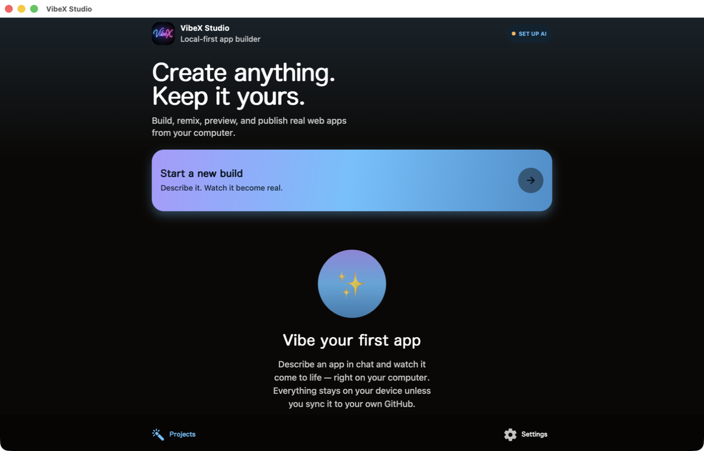

# VibeX Studio Desktop

A Tauri shell around the [VibeXStudio](https://github.com/kerpopule/vibexstudio)
web build — the free, open-source studio on macOS, Windows, and Linux, and
the place [Media Lab](https://github.com/kerpopule/media-lab-studio) plugs in.

<p align="center">
  
  &nbsp;
  
</p>

## Download

Grab the [latest release](https://github.com/kerpopule/vibexstudio/releases/latest)
— after that the app updates itself (see **Releases + auto-update** below):

| OS | File | Notes |
|---|---|---|
| macOS (Apple Silicon) | `VibeXStudio_*_aarch64.dmg` | Signed + notarized |
| Windows x64 | `VibeXStudio_*_x64-setup.exe` / `.msi` | Unsigned for now — SmartScreen asks once |
| Linux x64 | `VibeXStudio_*_amd64.deb` / `.AppImage` | |
| Linux arm64 | `VibeXStudio_*_arm64.deb` / `aarch64.AppImage` | Tested on an NVIDIA DGX Spark |

No accounts, no telemetry: projects live on your machine, AI keys are yours,
and device sync rides your own iCloud/Drive — see the app repo's
[docs/SYNC.md](https://github.com/kerpopule/vibexstudio/blob/main/docs/SYNC.md).

## How it fits together

- `dist/` — the exported VibeXStudio web app (`npx expo export --platform web
  --output-dir dist-web` in `../vibex-studio`, copied here). Projects, chat,
  and generated files persist in IndexedDB (`src/lib/storage/projects.web.ts`
  in the app repo).
- `src-tauri/` — the native shell (`src/lib.rs`). It spawns two sidecars
  that ship **inside the bundle** and stops them on quit:
  - **Workbench** — `workbench/server.mjs` (zero-dependency Node; the phone's
    remote build/dev/preview engine, contract in `workbench/API.md`). Needs a
    system Node ≥ 18: the shell probes the `node` hint in `workbench.json`,
    then `/opt/homebrew/bin`, `/usr/local/bin`, `/usr/bin`, `~/.local/bin`,
    then `PATH`. No Node → it logs why and `sidecar_status` reports it.
  - **Media Lab** — the FastAPI studio, staged from the
    [media-lab-studio](https://github.com/kerpopule/media-lab-studio) repo
    into `src-tauri/resources/media-lab/` by `scripts/stage-medialab.sh`
    (gitignored; 163 files / ~80 MB — no `.git`, `docs/`, `__pycache__`,
    template-library `.jpg` previews, local secrets, or Linux engine wheels).
    It runs only after the user opts in (below). Its Python venv lives in the
    app data dir; its data root stays `~/media-lab-simple` (or
    `$MEDIA_LAB_HOME`, passed through).
- Config lives in `app_data_dir` — macOS
  `~/Library/Application Support/studio.vibex.desktop/`:
  `medialab.json` `{enabled, dir, python, port}`, `workbench.json`
  `{enabled, port, token, projectsRoot}` (mode 600), `desktop.json`
  `{mediaLabAsked, mediaLabChoice}`.
- **Secrets never sit in those files.** The frontend stores API keys and
  tokens through the `secret_set` / `secret_get` / `secret_delete` commands,
  which wrap the OS keychain (`keyring` crate — macOS Keychain, Windows
  Credential Manager, Secret Service on Linux) under the service
  `studio.vibex.desktop`. Keys must be in the `vibex.*` namespace
  (`vibex.github.token`, `vibex.workbench.token`,
  `vibex.private.installation-proof`, `vibex.provider.<id>`,
  `vibex.refresh.<id>`, `vibex.private-proof.<id>`); anything else is refused.

## First launch

When there is no `medialab.json` and the question was never answered, the
shell opens a small window: **"Make media on this computer?"**

- **Yes, set it up** → the shell (Rust, no scripts) creates
  `app_data_dir/medialab-venv` with `python3 -m venv` (falls back to
  `uv venv`), installs `requirements.txt` from the staged source — or
  `fastapi uvicorn pydantic python-multipart` when there is none — seeds
  `~/media-lab-simple` (links `static/` to the bundle), writes
  `medialab.json`, mints a `workbench.json` if Node is present and none
  exists, starts both sidecars, and then swaps to the **Pair your phone** QR.
  Progress shows in the window; failures name the fix (no Python 3, no
  network…).
- **Not now** → remembered in `desktop.json`; the app never nags again.

Either choice can be revisited from the **Media Lab** menu:
*Pair your phone…* (QR + **Copy link**), *Make media on this computer…*
(re-opens the question / repairs the env), *Rotate Workbench token*
(new token in `workbench.json`, sidecar restarted, fresh QR — old phones are
unpaired).

The pairing payload is unchanged:
`vibex://pair?medialab=http://<lan-ip>:7863&workbench=http://<lan-ip>:8794&wbt=<token>`
(legacy `?url=` when no Workbench is configured).

### Tauri commands (frontend ↔ shell)

| Command | Returns |
|---|---|
| `sidecar_status` | `{workbench:{running,port,reason}, medialab:{running,port,reason}}` |
| `medialab_status` | `{enabled, running, port, phase, message, error, pairUrl}` — `phase` ∈ idle/venv/installing/starting/ready/error |
| `medialab_enable` / `medialab_disable` / `medialab_not_now` / `show_pair_window` | setup on a background thread / stop + `enabled:false` / remember "not now" / swap the first-launch page for the QR window |
| `workbench_rotate_token` | new token, sidecar restarted |
| `secret_set(key,value)` / `secret_get(key)` / `secret_delete(key)` | OS keychain, `vibex.*` keys only |
| `check_for_updates` | `{current, available, version, notes, error}` — also shows the native update / up-to-date / error dialog |

`app.withGlobalTauri` is on, so `window.__TAURI__.core.invoke(...)` works
from the web build and from the shell's own pages.

## Build

```sh
npm install
bash scripts/stage-medialab.sh   # copies ../media-lab-studio (or ../media-lab) into src-tauri/resources/media-lab
npx tauri build                  # .app + .dmg in src-tauri/target/release/bundle
npx tauri dev                    # against `npx expo start --web` in ../vibex-studio
```

`stage-medialab.sh` looks for `app.py` in `$MEDIALAB_SRC`,
`../media-lab-studio`, `../media-lab`, the same two one level up (git
worktrees), then `~/Projects/media-lab-studio`; it writes `STAGED.txt` with
the source commit. CI clones the repo and stages it before building. A build
without the staged directory still works — the first-launch page then says
this build doesn't include Media Lab.

Checks: `cd src-tauri && cargo build && cargo test` (add `-- --ignored` for
the live keychain round-trip) and `bash workbench/test.sh` (the Workbench
contract, sandboxed config).

Refresh the frontend after app changes:

```sh
cd ../vibex-studio && npx expo export --platform web --output-dir dist-web
rm -rf dist && cp -R ../vibex-studio/dist-web dist
```

## Releases + auto-update

Public releases live on the monorepo
[kerpopule/vibexstudio](https://github.com/kerpopule/vibexstudio/releases),
whose `desktop/` directory is a snapshot of this repo. One release = one tag
`vX.Y.Z` that matches `version` in `src-tauri/tauri.conf.json` (CI refuses
a mismatch). Three parts:

1. **Tag → CI** (`.github/workflows/build-desktop.yml` on the monorepo,
   `release` job): `tauri-apps/tauri-action` builds Windows x64, Linux x64
   and Linux arm64, signs each updater bundle with the minisign key in the
   `TAURI_SIGNING_PRIVATE_KEY` secret, and publishes the release
   "VibeXStudio vX.Y.Z" with the installers, their `.sig` files and
   `latest.json` (the updater manifest; NSIS preferred on Windows). The
   macOS runner only proves the build compiles — its artifact is unsigned
   and never published. Pushes to `main` still run the artifacts-only
   `build` job.
2. **Mac → `scripts/release-mac.sh vX.Y.Z`** on the Mac with the Developer
   ID cert. It exports the same signing key from
   `~/.vibex-secrets/tauri-updater.key`, so `tauri build` also emits
   `VibeXStudio.app.tar.gz` + `.sig`; notarizes; uploads the DMG, tarball
   and signature to the tag's release (`gh release upload --clobber`); then
   `scripts/merge-latest-json.mjs` downloads the release's `latest.json`,
   adds/replaces the `darwin-aarch64` entry (url + signature), refreshes
   `version`/`notes`/`pub_date`, and re-uploads it. The script creates the
   release if CI hasn't yet. Dry-run the merge against a fixture with
   `node scripts/merge-latest-json.mjs v1.2.0 --input latest.json --tarball x.tar.gz --dry-run`.
3. **The app** (`tauri-plugin-updater`, `plugins.updater` in
   tauri.conf.json): 3 s after launch it fetches
   `https://github.com/kerpopule/vibexstudio/releases/latest/download/latest.json`,
   compares `version` with its own, and — only if newer — shows
   "VibeX Studio X.Y.Z is ready — Update now / Later" with the release
   notes. *Update now* downloads (progress in the log), verifies the `.sig`
   against the embedded pubkey, installs (Windows: passive installer) and
   relaunches. Failures on launch (no release yet, offline) are logged, never
   shown. **VibeX Studio → Check for updates…** (Help menu on
   Windows/Linux) runs the same check and reports "You're up to date" or the
   error. `VIBEX_NO_UPDATE_CHECK=1` skips the launch check.

Bumping a version: edit `version` in `src-tauri/tauri.conf.json`,
`src-tauri/Cargo.toml` and `package.json`, commit, refresh the monorepo
(`oss-publish/refresh-monorepo.sh`), tag it there, run the mac script.
The public key is in tauri.conf.json; the private key exists only in
`~/.vibex-secrets/` (README there) and the GitHub secret — lose it and no
installed copy can ever update again.

## Roadmap

1. ~~Media Lab sidecar~~ — bundled, opt-in on first launch (above). Still
   open: a self-contained Python (today it needs a system `python3`), and
   the engine shelf for GPU machines.
2. **Native file storage** — swap IndexedDB for Tauri fs behind the same
   storage interface, so projects live as real folders.
3. ~~Pairing QR~~ — shipped (`vibex://pair?...`, Copy link).
4. ~~Auto-update~~ — shipped (Releases + auto-update above). Still open:
   Windows code signing so SmartScreen stops asking.

## License

Apache-2.0 (see LICENSE). The Media Lab open-source build must never bundle
the H3 engine — its license covers private single-machine use only.

## Credits

Built on [Tauri 2](https://tauri.app) (shell), the VibeXStudio Expo web
build (frontend), and Media Lab's FastAPI server (sidecar). See CREDITS.md
in those repos — we credit what we build on, required or not.
