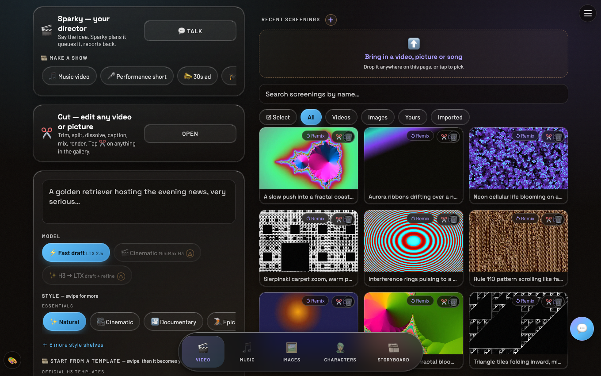
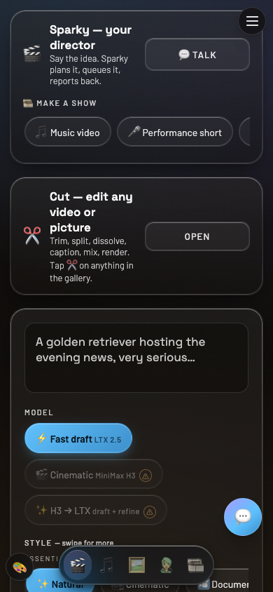

# Media Lab 🎬

**A private AI media studio that runs on your own hardware.**

Type an idea; get films, songs, images, characters, and talking-head video.
Sparky — the built-in director — plans shows, queues renders, and reports
back. Phone-first PWA, works on anything with a browser. Free, open source,
Apache-2.0. **No accounts, no telemetry, no per-render bills.**

<p align="center">
  
  &nbsp;
  
</p>

## What it does

- **Video** — fast drafts (LTX) and cinematic renders (MiniMax H3 modes:
  text-to-video, image-to-video, reference-identity, v2v motion transfer),
  long-form via segment chaining, 500+ curated style templates.
- **Music & music videos** — full songs and storyboarded MVs. Screenshot songs default to Exact Auto-fit: reviewed words remain immutable, text is reflowed into short melodic phrases, Auto chooses each part's runtime, and long inputs split into ordered queue-owned songs plus matching screenshot videos. Director checks both the words and measurable pitch movement, so read/recited takes are retried instead of published. See [docs/screenshot-songs.md](docs/screenshot-songs.md).
- **Images** — generation, SAM-powered tap-to-select editing, FLUX Kontext,
  and a big template library.
- **Characters** — reusable identities with consistent look and voice
  (Voicebox voice cloning included).
- **Sparky** — a chat director that plans, queues, and narrates the work.
- **Automatic Storyboards** — every completed Media Lab production with more
  than one scene is persisted as an editable Storyboard and linked from its
  queue/gallery record. This is enforced by the shared backend for paired
  phone/tablet, web, desktop, and Spark surfaces; one-shot jobs stay one-shot.
- **Show presets** — music video · performance short · 30s ad · explainer ·
  motion text · episode, each one tap from a finished brief.

## Run it

One command, then scan the QR it prints with the VibeXStudio phone app:

```sh
./install.sh
```

It creates `.venv`, mints your access code, starts the server (a `systemd
--user` service on Linux; foreground on a Mac, `--service` for a launchd
agent), waits until it answers, and prints the URLs, the code and a pairing
QR. Re-run it after `git pull` to update. `media-lab status|pair|code|logs`
drive it afterwards. Details, flags, troubleshooting: [docs/INSTALL.md](docs/INSTALL.md).

Manual fallback, same thing by hand:

```sh
pip install -r requirements.txt
uvicorn app:app --host 0.0.0.0 --port 7863
```

### On your own GPU box (the full studio)

Built and battle-tested on a single NVIDIA DGX Spark; any Linux box able to
run your chosen engines works the same way. Engines (LTX, H3, ComfyUI
image/music) are installed and licensed by **you** from the first-run shelf
in the web UI — see `media_lab_core/` for the hash-pinned catalog/installer
contracts and [AGENTS.md](AGENTS.md) for the guided setup an AI agent can
run end-to-end. No model weights ship in this repo.

### On any machine, cloud-only (no GPU)

Run `./install.sh` anywhere, open the theme sheet → **Cloud providers**, paste
your [fal.ai](https://fal.ai) key, and pick model ids. `fal-image` and
`fal-video` engines appear next to the local ones. Your key, your bill, no
middleman.

### Paired with VibeXStudio

The [VibeXStudio desktop app](https://github.com/kerpopule/vibexstudio-desktop)
can host Media Lab as a sidecar, and the
[phone app](https://github.com/kerpopule/vibexstudio) pairs to any Media Lab
over your LAN or tailnet — a Media Lab tab appears in the app.

## Good to know

- **The H3 model is separately licensed** (private, single-machine use).
  This repo carries integration code only — never the model, and the open
  build must not bundle it.
- Jobs, galleries, voices, and characters live in flat files under
  `~/media-lab-simple` on the machine that runs the server.
- What the public repo deliberately excludes:
  [docs/open-source-readiness.md](docs/open-source-readiness.md).

## License & credits

Apache-2.0. Media Lab stands on Maestro/WanGP, LTX-Video, ComfyUI, Qwen,
FLUX, and a generous community of prompt-craft — see
[CREDITS.md](CREDITS.md). We credit everything we build on, required or
not; if your work appears uncredited, open an issue.
